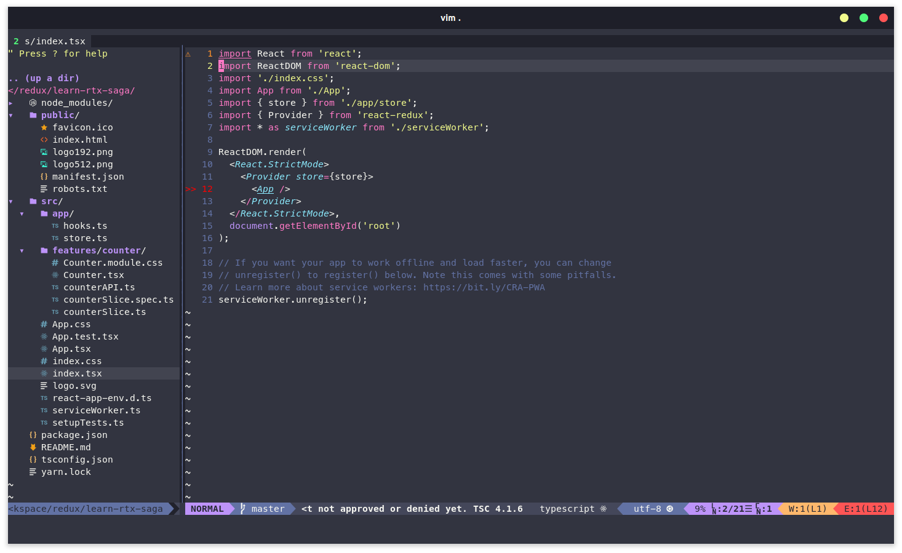

# React-redux-toolkit-saga-typescript

## Create project

### Using YARN:

```tsx
yarn create react-app <*project-name*> --template redux-typescript
```

### Using NPM:

```tsx
npx create-react-app <*project-name*> --template redux-typescript
```



## Start project

### Yarn:

```tsx
yarn start
```

### Npm:

```tsx
npm start
```


## Configuration project

### BaseUrl

Add the `"baseUrl": "./src"` in the _tsconfig.json_ file


### Prettier config (option)

Create the Prettier config file in root folder project `/.prettierrc`

Go to [https://prettier.io/playground/](https://prettier.io/playground/) to render a config json online and paste to `.prettierrc` file


## Add Redux Saga

### Installation

```tsx
yarn add redux-saga
```

or

```tsx
npm install redux-saga
```

### Create a Saga middleware

Create a Saga Middleware and then, add this to default Redux's middleware

```tsx
import createSagaMiddleware from 'redux-saga';

const sagaMiddleware = createSagaMiddleware();
export const store = configureStore({
  reducer: {
    counter: counterReducer,
  },
  middleware: (getDefaultMiddleware) =>
    getDefaultMiddleware().concat(sagaMiddleware),
});

sagaMiddleware.run(rootSaga);
```

<<<<<<< HEAD


### Hello Saga !

`all` function of `reduxSaga/effects` is a function that create an Effect description that instructs the middleware to run multiple Effects in parallel that wait for all of them to complete. It's quite the corresponding API to standard.


### [Function] `takeEvery()`

is a high-level API build using take and fork. Here is how the helper could be implemented using the low-level Effects

We using `'*'` to take every user_requested


Or an 'user_requested' if you want and we got 2 ways :


and


### Effect Creator

`takeEvery()` is a Effect Creator

- Each function below returns a plain JavaScript object and does not perform any execution.
- The execution is performed by the middleware during the iteration process described above.
- The middleware examines each Effect description and performs the appropriate action.

See more Effect Creator: [https://redux-saga.js.org/docs/api/#effect-creators](https://redux-saga.js.org/docs/api/#effect-creators)

### Create _Add async saga_ button

# 
